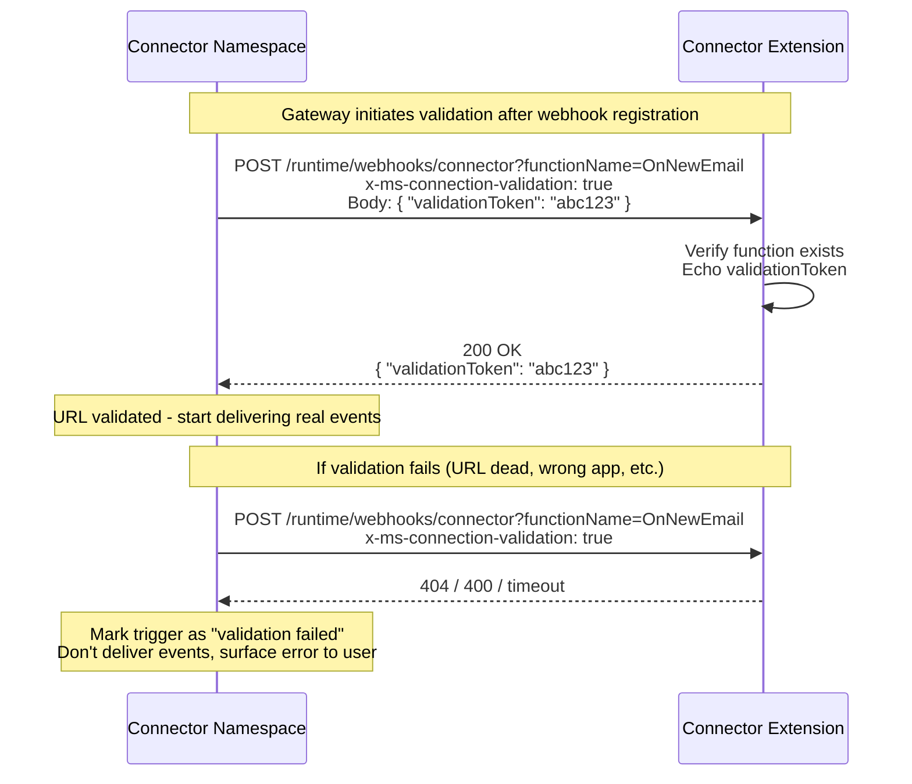

# Connector Trigger - Connection Handshake Design

> **Status: Deferred** - This is a Connector Namespace team initiative. The extension side is trivial (~20 lines). Parked until the gateway team decides to implement it.

## Overview

Connection handshake is a **one-time validation** that happens when the Connector Namespace first sends events to a registered webhook URL. It allows the gateway to verify the URL is live and owned by a real connector extension before committing to event delivery.

This is separate from [header validation](header-validation-design.md) which runs on
**every request**. Both features are independent and complementary:

| Feature | Runs when | Owned by | Purpose |
| --------- | ----------- | ---------- | --------- |
| **Connection handshake** (this doc) | Once - after webhook registration | Connector Namespace (initiates), Extension (responds) | Verify URL is live before sending real events |
| **Header validation** ([other doc](header-validation-design.md)) | Every request | Connector Extension (validates) | Verify each request is correctly routed |

### Why Both Exist

Handshake prevents the gateway from sending events into the void (dead URL, wrong app).
Header validation prevents spoofed or misrouted events from being processed. Neither replaces the other.

## Ownership

This is primarily a **Connector Namespace feature**. The gateway initiates the handshake, the extension only needs to respond. Implementation effort:

| Side | What they build | Effort |
| ------ | ---------------- | -------- |
| **Connector Namespace** | Send validation request before first event delivery. Wait for valid response. Mark trigger as "validated". Retry/fail if no response. Don't deliver events until handshake succeeds. | Medium |
| **Connector Extension** | Detect `x-ms-connection-validation: true` header in `ConvertAsync()`. Echo back `validationToken`. ~20 lines of code. | Small |

## Dependencies and Prerequisites

### Extension-Side Dependencies

No new NuGet packages required. Uses existing `HttpRequestMessage` header parsing and `System.Text.Json` for validation token response.

### Connector Namespace Prerequisites

| Prerequisite | Details | Priority | Status |
| ------------- | --------- | ---------- | -------- |
| **Validation request support** | Gateway must send requests with `x-ms-connection-validation: true` header to initiate handshake | P0 - blocks handshake | Not available |
| **Validation token protocol** | Gateway must include a `validationToken` in the body and expect it echoed back | P0 - protocol agreement | Not available |
| **Handshake before events** | Gateway should perform validation handshake before sending real events to a newly registered webhook | P1 - ordering guarantee | Not available |

### Priority

**P2** - Operational improvement for the gateway team. The extension side is trivial to implement. The main value is for the gateway - fast feedback that a URL is wrong/dead instead of silently sending events into the void. Can be added after header validation is implemented.

## Handshake Flow



## Extension-Side Implementation

Detect validation requests in `ConnectorExtensionConfigProvider.ConvertAsync()`,
before routing to the function executor:

```csharp
// In ConvertAsync(), early check before normal processing
if (input.Headers.TryGetValues("x-ms-connection-validation", out var validationValues)
    && string.Equals(validationValues.First(), "true", StringComparison.OrdinalIgnoreCase))
{
    // Echo the validation token back
    var body = await input.Content.ReadAsStringAsync(cancellationToken);
    using var doc = JsonDocument.Parse(body);
    if (doc.RootElement.TryGetProperty("validationToken", out var token))
    {
        var response = new HttpResponseMessage(HttpStatusCode.OK)
        {
            Content = new StringContent(
                JsonSerializer.Serialize(new { validationToken = token.GetString() }),
                Encoding.UTF8, "application/json")
        };
        return response;
    }
    return new HttpResponseMessage(HttpStatusCode.BadRequest);
}
// else: proceed to normal event processing
```

## Gateway-Side Implementation (ask for Connector Namespace team)

When a new triggerConfig is created or callbackUrl is updated:

1. Before sending real events, POST a validation request to the callbackUrl
2. Include `x-ms-connection-validation: true` header and `{ "validationToken": "{random}" }` body
3. Expect 200 OK with the same `validationToken` echoed back
4. If validation succeeds - mark trigger as active, start delivering events
5. If validation fails (non-200, timeout, wrong token) - mark trigger as "validation failed", surface error

This is the same pattern Event Grid uses for subscription validation.
