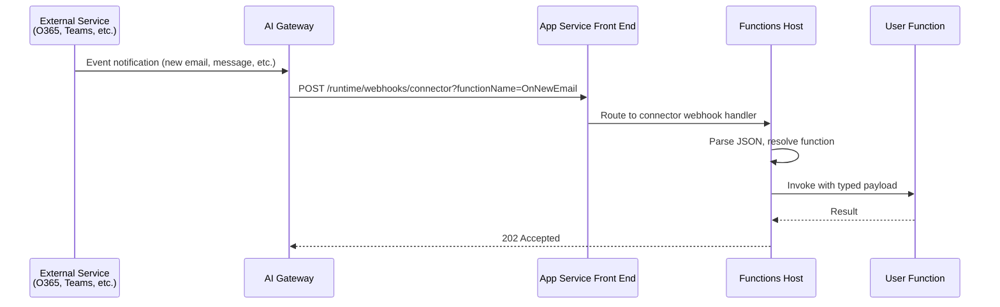
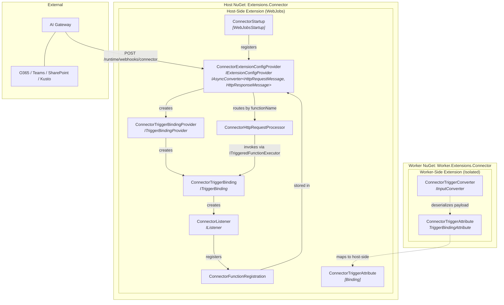
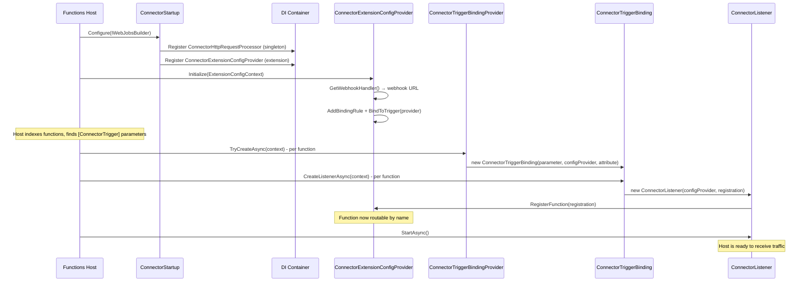
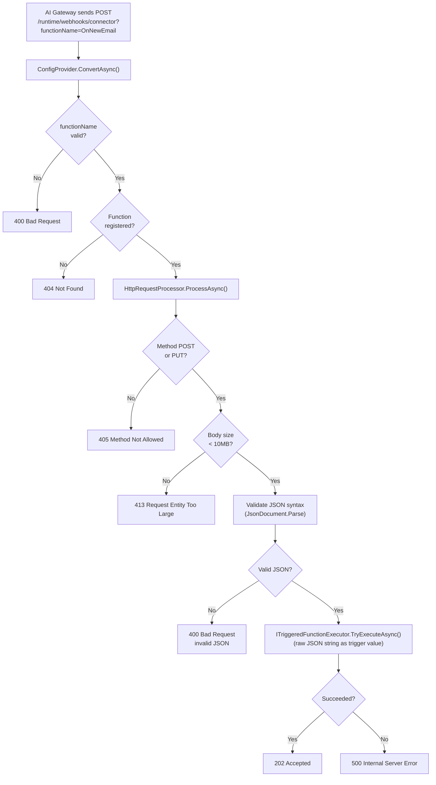
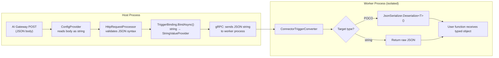

# Azure Functions Connector Extension - Design Document

## Overview

The Connector Extension enables Azure Functions to receive event-driven triggers from external services (Office 365, Teams, SharePoint, etc.) through the **AI Gateway**.
Instead of each function managing its own connection to an external service, the AI Gateway centralizes connection management, authentication, and event delivery. Functions simply declare what connector and operation they want to listen to via a `[ConnectorTrigger]` attribute.

### What Problem Does This Solve?

Today, to react to an external service event (e.g., "new email in O365"), developers must:

1. Manage OAuth tokens / credentials for each external service
2. Implement polling or webhook subscription logic
3. Handle token refresh, retry, and connection lifecycle
4. Deal with per-service API differences

AI gateway abstracts and manages these operations. A function becomes:

```csharp
[Function("OnNewEmail")]
public void Run(
    [ConnectorTrigger(
        AIGateway = "HRGateway",
        ConnectorType = "Office365",
        Operation = "OnNewEmailV3",
        Connection = "MyO365Connector")]
    Office365OnNewEmailV3TriggerPayload payload)
{
    // Just handle the event - no auth, no polling, no webhook management
}
```

---

## Architecture

### High-Level Flow



### Component Architecture



---

## Package Structure

The extension ships as **two NuGet packages**, following the standard Azure Functions
extension pattern:

```
azure-functions-connector-extension/
├── src/
│   ├── Microsoft.Azure.Functions.Extensions.Connector/     # Host-side (WebJobs)
│   │   ├── ConnectorStartup.cs                             # Extension registration
│   │   ├── ConnectorExtensionConfigProvider.cs             # Webhook handler + routing
│   │   ├── ConnectorTriggerAttribute.cs                    # [ConnectorTrigger] attribute
│   │   ├── ConnectorTriggerBindingProvider.cs              # Creates bindings per function
│   │   ├── ConnectorTriggerBinding.cs                      # Binds trigger data + creates listener
│   │   ├── ConnectorListener.cs                            # Lifecycle (start/stop)
│   │   ├── ConnectorFunctionRegistration.cs                # Function metadata record
│   │   ├── ConnectorHttpRequestProcessor.cs                # HTTP parsing + validation
│   │   └── ConnectorWebJobsBuilderExtensions.cs            # DI registration
│   │
│   └── Microsoft.Azure.Functions.Worker.Extensions.Connector/  # Worker-side (isolated)
│       ├── ConnectorTriggerAttribute.cs                    # Worker attribute (mirrors host)
│       └── Converters/
│           └── ConnectorTriggerConverter.cs                 # JSON → POCO deserialization
│
├── samples/
│   ├── dotnet-isolated/                                    # C# isolated worker sample
│   └── python/                                             # Python sample
│
└── test/
    └── Microsoft.Azure.Functions.Extensions.Connector.Tests/
```

| Package | Ships To | Purpose |
|---------|----------|---------|
| `Microsoft.Azure.Functions.Extensions.Connector` | Functions Host process | Webhook endpoint, trigger binding, request routing |
| `Microsoft.Azure.Functions.Worker.Extensions.Connector` | Worker process (isolated) | Attribute definition, payload deserialization |

---

## Trigger Attribute

The `[ConnectorTrigger]` attribute is the developer-facing API. It appears on the trigger
parameter and declares which connector type, operation, and AI gateway to use.

### Properties

| Property | Type | Required | Description |
|----------|------|----------|-------------|
| `AIGateway` | `string` | Yes | AI Gateway endpoint name. Resolved from app settings via `{name}__endpoint` convention. |
| `ConnectorType` | `string` | Yes | Connector type name (e.g., `"office365"`, `"teams"`, `"sharepointonline"`) |
| `Operation` | `string` | Yes | Trigger operation ID (e.g., `"OnNewEmailV3"`, `"OnNewChannelMessage"`) |
| `Connection` | `string` | Yes | Logical name of the connector instance inside the AI Gateway |

### Example - C# Isolated Worker

```csharp
[Function("OnNewEmail")]
[BlobOutput("emails/{rand-guid}.json", Connection = "BlobStoreConnection")]
public string OnNewEmail(
    [ConnectorTrigger(
        AIGateway = "HRGateway",
        ConnectorType = "office365",
        Operation = "OnNewEmailV3",
        Connection = "HRMailboxConnector")]
    Office365OnNewEmailV3TriggerPayload payload)
{
    _logger.LogInformation("Subject: {Subject}", payload.Body?.Value?.First()?.Subject);
    return JsonSerializer.Serialize(payload);
}
```

### Example - Python

```python
@app.generic_trigger(
    arg_name="payload",
    type="connectorTrigger",
    aiGateway="HRGateway",
    connectorType="Office365",
    operation="OnNewEmailV3",
    connection="HRMailboxConnector")
def on_new_email(payload: str) -> None:
    data = json.loads(payload)
    logging.info(f"Subject: {data['body']['value'][0]['subject']}")
```

---

## Extension Lifecycle

### Initialization Sequence



### Request Processing Flow



---

## Component Details

### ConnectorExtensionConfigProvider

The central component - serves two roles:

1. **Extension initialization** - registers the binding rule and webhook handler
2. **HTTP request handler** - implements `IAsyncConverter<HttpRequestMessage, HttpResponseMessage>`
   to handle incoming webhook callbacks from the AI Gateway

Key design decisions:

- Uses `context.GetWebhookHandler()` to register at `/runtime/webhooks/connector`
- Routes requests to functions by `?functionName=` query parameter
- Maintains a `ConcurrentDictionary<string, ConnectorFunctionRegistration>` for O(1) function lookup
- Validates function names with regex: `^[a-zA-Z0-9_-]{1,128}$`

### ConnectorTriggerBinding

Creates the bridge between the webhook payload and the function parameter:

- **Trigger value type**: `string` - the raw JSON string from the AI Gateway
- **IValueProvider**: `StringValueProvider` passes the raw JSON string directly
- No Newtonsoft.Json dependency - the host extension is JSON-library-agnostic

### ConnectorListener

Manages function lifecycle registration. Currently registers the function with the config
provider at construction time.

**Planned enhancement**: `StartAsync()` will register the webhook callback URL with the
AI Gateway, eliminating the manual webhook setup step. See
[webhook-auto-registration-design.md](webhook-auto-registration-design.md).

### ConnectorHttpRequestProcessor

Handles HTTP-level concerns:

- Method validation (POST/PUT only)
- Body size validation (10 MB limit)
- JSON syntax validation via `System.Text.Json.JsonDocument.Parse()` (no deserialization)
- Error handling with appropriate HTTP status codes
- Request logging

### ConnectorTriggerConverter (Worker-Side)

Runs in the isolated worker process. Handles deserialization of the JSON string
(received via gRPC from the host) into the target POCO type:

```
Host: raw JSON string → gRPC → Worker: JSON string → ConnectorTriggerConverter → POCO
```

Serialization stack:

- Host side: **no JSON library** - passes raw string through
- Worker side: **System.Text.Json** - deserializes to target type

Supports:

- `string` target - returns raw JSON
- Any POCO type - deserializes via `System.Text.Json`

---

## Data Flow - Host to Worker



---

## Webhook Endpoint

The extension registers a webhook endpoint at:

```
https://{app}.azurewebsites.net/runtime/webhooks/connector?functionName={name}
```

This is a **data-plane endpoint** secured by the Functions host's webhook key mechanism
(the key is in the `host.json` `extensions.connector` section, managed by the Functions
runtime).

### URL Format

| Component | Value |
|-----------|-------|
| Base | `https://{app}.azurewebsites.net` |
| Path | `/runtime/webhooks/connector` |
| Query | `?functionName={functionName}` |
| Auth | Webhook key (managed by Functions runtime) |

### Routing

One webhook endpoint serves all connector-triggered functions in the app. The `functionName`
query parameter selects which function to invoke. This avoids needing a separate URL per
function.

---

## Language Support

| Language | Model | Trigger Surface | Typed Payload | Status |
|----------|-------|----------------|:-------------:|--------|
| **C# (isolated worker)** | Worker extension NuGet | `[ConnectorTrigger]` attribute | Yes - `ConnectorTriggerConverter` deserializes to POCO | Implemented |
| **Python** | Extension bundle + generic trigger | `@app.generic_trigger(type="connectorTrigger", ...)` | No - payload as `str`, developer parses | Tested (generic trigger) |
| **Node.js** | Extension bundle + generic trigger | `generic` binding in `function.json` | No - payload as `string` | Not tested |
| **Java** | Extension bundle + generic trigger | `@GenericTrigger(type="connectorTrigger")` annotation | No - payload as `String` | Not tested |
| **PowerShell** | Extension bundle + `function.json` | `connectorTrigger` binding in `function.json` | No - payload as `[string]` | Not tested |

### What Works Today

C# isolated worker has a dedicated trigger attribute and typed payload converter.
Python has been tested using the generic trigger model. Node.js, Java, and
PowerShell should work via the generic binding model (the host extension handles everything),
but have **not been tested** yet.

### Language-Specific Enhancements (to be done)

To provide a first-class developer experience (dedicated decorators, typed models,
IntelliSense), language-specific libraries need to be built.

### Priority

1. **C# isolated** - done (worker extension NuGet)
2. **Python** - high priority (dedicated decorator + typed models)
3. **Node.js / TypeScript** - medium (TypeScript interfaces for payload types)
4. **Java / PowerShell** - lower (dedicated annotations)

---

## Configuration

### App Settings

```json
{
    "Values": {
        "AzureWebJobsStorage": "UseDevelopmentStorage=true",
        "FUNCTIONS_WORKER_RUNTIME": "dotnet-isolated",
        "HRGateway__endpoint": "https://gateway-hr.contoso.net",
        "FinanceGateway__endpoint": "https://gateway-finance.contoso.net"
    }
}
```

### host.json

No custom `host.json` configuration required. The extension uses the default webhook
key management from the Functions runtime.

---

## Planned Enhancements

| Feature | Status | Design Doc |
|---------|--------|-----------|
| **Extension bundle integration** | Upcoming | N/A |
| **Webhook auto-registration** | Designed | [webhook-auto-registration-design.md](webhook-auto-registration-design.md) |
| **Local dev experience** | In-Progress | [local-dev-tunnel-design.md](local-dev-tunnel-design.md) |
| **Header validation** | In-Progress | [header-validation-design.md](header-validation-design.md) |
| **Connection handshake** | In-Progress | [connection-handshake-design.md](connection-handshake-design.md) |
| **Polling AI Gateway** | In-Progress | [connection-handshake-design.md](connection-handshake-design.md) |
| **Distributed tracing** | In-Progress | [distributed-tracing-design.md](distributed-tracing-design.md) |
| **Batch dispatch** | In-Progress | [batch-dispatch-design.md](batch-dispatch-design.md) |
| **Input/output bindings** | Future | - |

### Webhook Auto-Registration (next)

The `ConnectorListener.StartAsync()` will automatically register the webhook callback URL
with the AI Gateway after function deployment. This eliminates the manual step of creating
the trigger subscription in the gateway and then updating it with the function's URL.
See [webhook-auto-registration-design.md](webhook-auto-registration-design.md) for full design.

---

## Security

| Concern | Mitigation |
|---------|-----------|
| **Webhook endpoint auth** | Protected by Functions runtime webhook key |
| **Function name validation** | Regex-validated: `^[a-zA-Z0-9_-]{1,128}$` |
| **Body size limit** | 10 MB max, checked at header and body level |
| **Input parsing** | JSON parse errors return 500, not leaked to caller |
| **Internal types** | All implementation types are `internal sealed` |
| **Test access** | `InternalsVisibleTo` limited to test assembly only |

---

## Dependencies

### Host-Side Extension

| Dependency | Version | Purpose |
|-----------|---------|---------|
| `Microsoft.Azure.WebJobs` | 3.0.42 | WebJobs SDK - binding framework |

No `Newtonsoft.Json` dependency - the host extension passes raw JSON strings
through the pipeline without deserialization.

### Worker-Side Extension

| Dependency | Version | Purpose |
|-----------|---------|---------|
| `Microsoft.Azure.Functions.Worker.Extensions.Abstractions` | 1.3.0 | `TriggerBindingAttribute` base class |
| `Microsoft.Azure.Functions.Worker.Core` | 2.51.0 | `IInputConverter` for payload deserialization |

---

## Testing

### Unit Tests

| Test Class | Covers |
|-----------|--------|
| `ConnectorTriggerAttributeTests` | Attribute property binding |
| `ConnectorTriggerBindingProviderTests` | Binding creation from attribute |
| `ConnectorTriggerBindingTests` | Trigger data binding, listener creation |
| `ConnectorListenerTests` | Function registration, lifecycle |
| `ConnectorExtensionConfigProviderTests` | Request routing, function name validation |
| `ConnectorHttpRequestProcessorTests` | HTTP parsing, size limits, error handling |

### Integration Testing

Use the sample apps to test end-to-end:

```powershell
# Build and run the .NET isolated sample
cd samples/dotnet-isolated
func start

# Send a test trigger event
curl -X POST "http://localhost:7071/runtime/webhooks/connector?functionName=OnNewEmail" \
  -H "Content-Type: application/json" \
  -d '{"body": {"value": [{"subject": "Test", "from": "test@example.com"}]}}'
```
