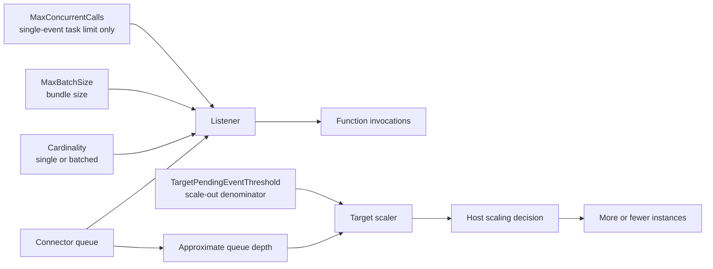
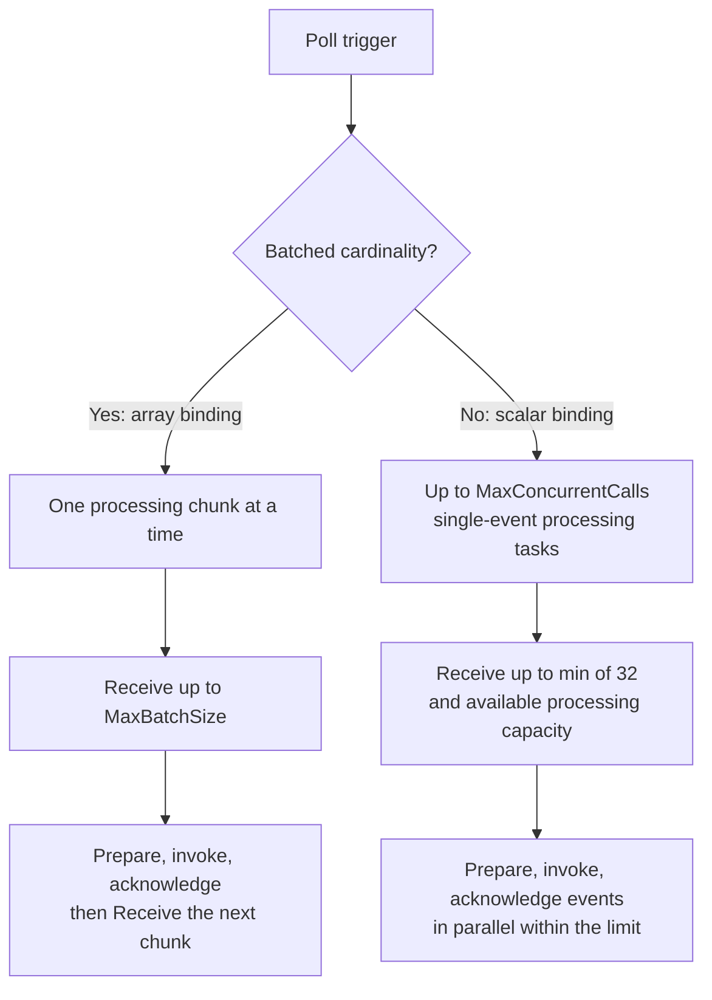
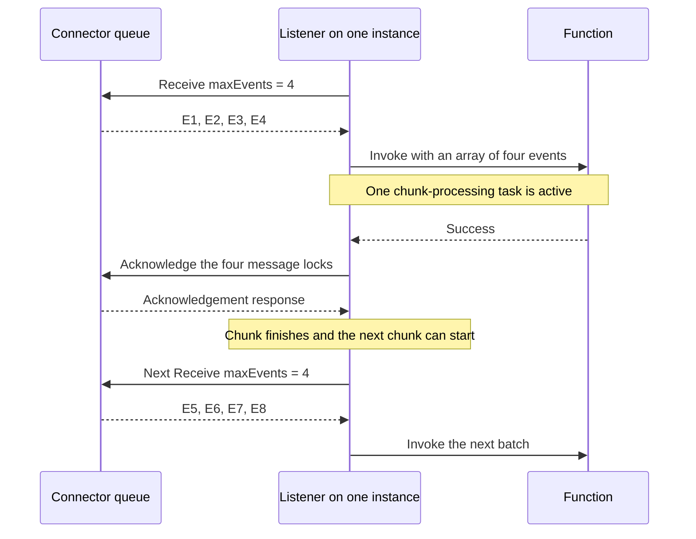
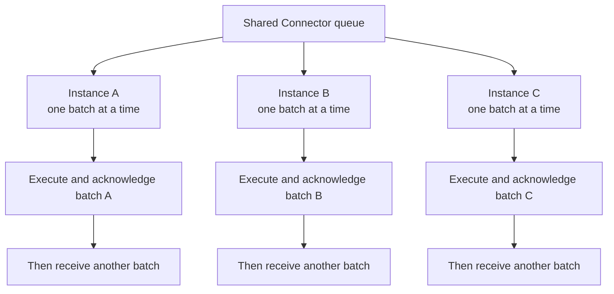
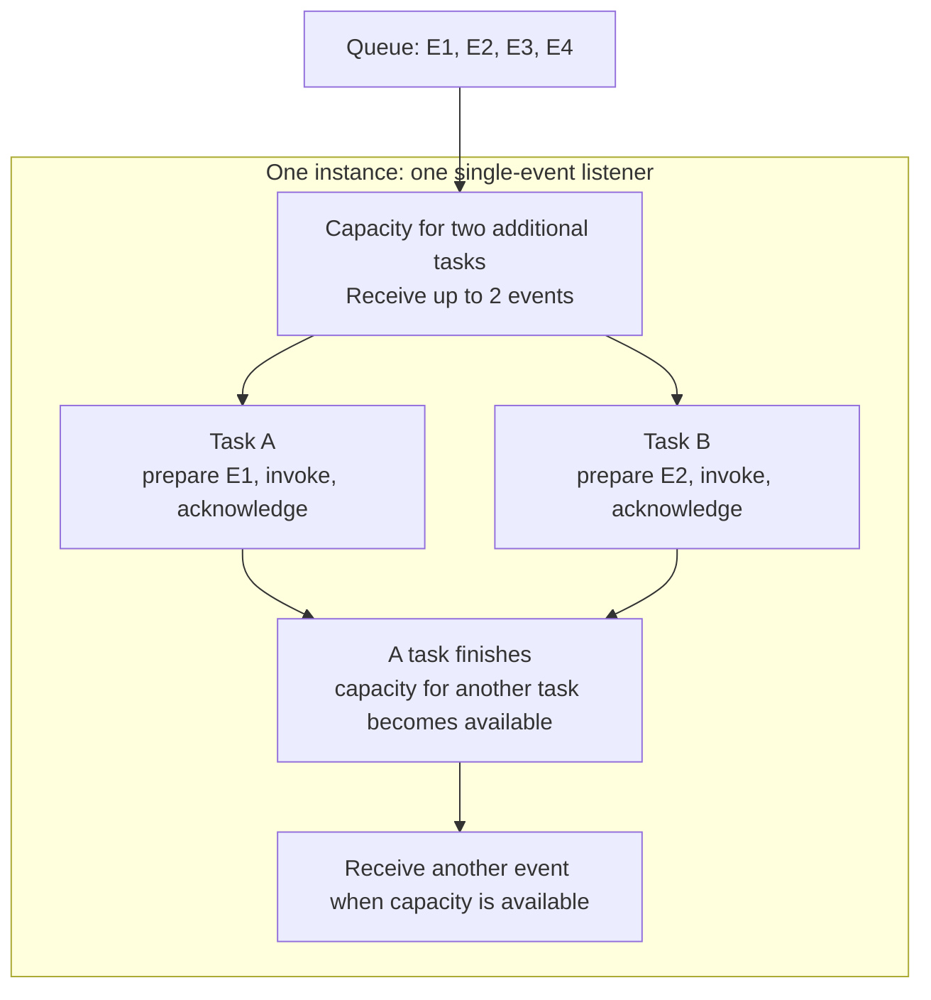
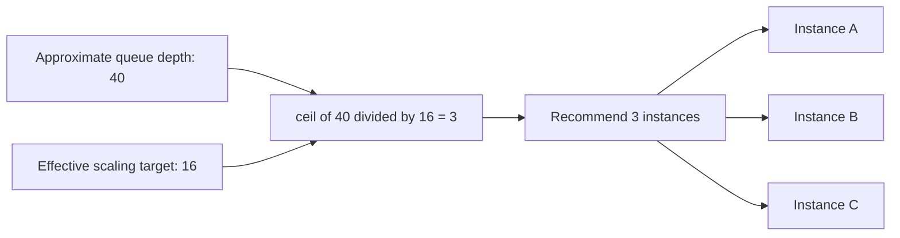
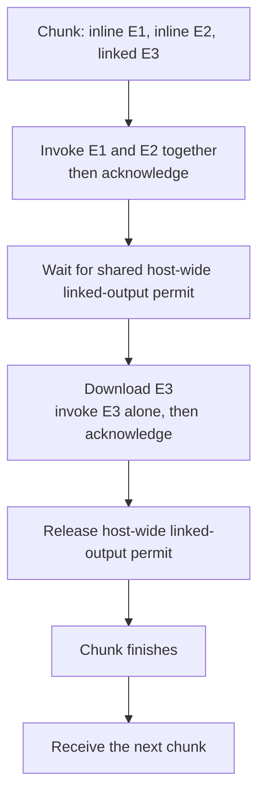

# Connector Poll: A Visual Guide to Batching, Concurrency, and Scaling

This guide describes the intended design for discussion: batched delivery processes one chunk at a time per listener, single-event delivery supports configurable concurrency, and scaling is independent of both. Implementation and the other repository documentation will be aligned after agreement; this guide is not a statement of current runtime behavior.

## Table of Contents

- [The Main Controls](#the-main-controls)
- [Two Delivery Shapes](#two-delivery-shapes)
- [Batched Delivery: One Chunk at a Time](#batched-delivery-one-chunk-at-a-time)
- [Single-Event Delivery: Bounded Parallel Processing](#single-event-delivery-bounded-parallel-processing)
- [How Receive Capacity Is Calculated](#how-receive-capacity-is-calculated)
- [How Scaling Chooses an Instance Target](#how-scaling-chooses-an-instance-target)
- [Where Settings Come From](#where-settings-come-from)
- [Linked Outputs](#linked-outputs)
- [Configuration Examples](#configuration-examples)
- [What Happens When You Change a Setting](#what-happens-when-you-change-a-setting)
- [Implementation Boundary](#implementation-boundary)

## The Main Controls

Think of batch size as events per invocation, concurrent calls as how many single-event invocations can overlap, and the scaling target as the queued-event count used to recommend an instance count.

| Setting | Meaning | Batched delivery | Single-event delivery |
| --- | --- | --- | --- |
| `MaxBatchSize` | Maximum events supplied to one invocation | 1 through 32 | Must resolve to 1 |
| `MaxConcurrentCalls` | Maximum concurrent single-event calls per listener on one instance | Does not apply; one batch at a time | Configurable; built-in default 16 |
| `TargetPendingEventThreshold` | Desired queued events per instance in the scaling calculation | Scaling only; built-in default 16 | Scaling only; built-in default 16 |
| `IsBatched` / cardinality | Whether the function receives one event or an array | Array | Scalar |
| `MaxPollingInterval` | Upper limit for empty-queue polling backoff | Host setting; default 30 seconds | Host setting; default 30 seconds |

For a batched function, choose `MaxBatchSize` if the default of 1 is too small; there is no batch-concurrency setting. For a single-event function, batch size stays at 1 and `MaxConcurrentCalls` can be left at its default unless workload measurements justify tuning it. For either mode, `TargetPendingEventThreshold` can also use its default; override it only when tuning scale-out behavior. Host-level polling backoff normally needs no per-function configuration.

`MaxConcurrentCalls` uses the familiar Service Bus name and applies only to single-event delivery. In the examples below, a "processing task" means the extension's work around a call: preparation, function invocation, and acknowledgement. That accounting detail explains when another call can start; it is not another customer setting.

`TargetPendingEventThreshold` is not a hard pending-event limit. `MaxPollingInterval` is not an invocation timeout or a shutdown grace period. Local processing limits apply separately to each trigger listener on each instance, not as one shared budget for every function in the app.



The listener controls work within an instance. The scaler recommends how many instances to run. Neither batch size nor the configured concurrent-call limit participates in the scaling formula.

Processing capacity is logical, not a set of dedicated threads or reserved CPU cores. The listener calculates it from the configured task limit minus the number of active tasks; it does not discover a safe concurrency limit from available CPU or memory. Asynchronous tasks can overlap while waiting for I/O without each owning a dedicated thread.

## Two Delivery Shapes

Cardinality selects the processing path, not batch size alone. An array binding with `MaxBatchSize = 1` still uses the sequential batch path.



For .NET isolated, `IsBatched = true` enables arrays. Non - dotnet, use `cardinality: "many"`.

## Batched Delivery: One Chunk at a Time

Example: eight inline events are queued and `MaxBatchSize = 4`. The listener receives up to four events, finishes processing that chunk, and only then receives another chunk.



The restriction is **one active processing chunk per trigger listener per instance**, not one batch across the whole app. It does not dictate how your function handles the events within its array: your code may process them sequentially or in parallel.

A Receive can return fewer than four events. A partial batch still counts as the one active chunk until it finishes; the listener does not fill unused array capacity while that chunk is active.

On failure or cancellation, unsuccessful work is left unacknowledged. Once the processing task finishes, the listener can proceed to another Receive without waiting for the failed events to become available for redelivery.

Different instances can still process batches concurrently:



The diagram does not assign fixed queue partitions. Each listener independently leases events from the service.

## Single-Event Delivery: Bounded Parallel Processing

Example: `MaxBatchSize = 1` and `MaxConcurrentCalls = 2`.



Up to two single-event calls can overlap. A slow invocation does not prevent the other call from progressing. The extension tracks each call's surrounding processing task; when two tasks are active, the configured limit has been reached and no new Receive is issued until one finishes.

A task counts against the limit during preparation, function execution, and acknowledgement, not just the time inside the function body. Completion of a failed or cancelled attempt also restores capacity for another task.

For example, `MaxConcurrentCalls = 4` with two active tasks leaves capacity for two additional tasks. This is permission to accept more work, not a guarantee that the machine can efficiently handle any four workloads. Select a conservative limit and tune it using representative throughput, latency, CPU, memory, and downstream-throttling measurements.

## How Receive Capacity Is Calculated

`maxEvents` is the per-request query parameter sent to Connector Namespace Receive. It is not a persistent service setting or the scaling threshold.

```text
Batched cardinality:
    while a chunk is active: do not Receive
    otherwise: maxEvents = effectiveMaxBatchSize

Single-event cardinality:
    availableProcessingCapacity =
        effectiveMaxConcurrentCalls - activeProcessingTasks
    if availableProcessingCapacity <= 0: do not Receive
    otherwise: maxEvents = min(32, availableProcessingCapacity)
```

Effective batch size is already limited to 32. The service can return fewer events than requested. The cap of 32 applies to one Receive response, not to the total number of concurrent single-event tasks.

| Cardinality | Batch size | Concurrent-call limit | Active tasks/chunks | Requested `maxEvents` |
| --- | ---: | --- | ---: | --- |
| Many | 4 | Not applicable | 0 | 4 |
| Many | 4 | Not applicable | 1 | No Receive |
| Many | 1 | Not applicable | 0 | 1 |
| One | 1 | 2 | 0 | 2 |
| One | 1 | 2 | 1 | 1 |
| One | 1 | 2 | 2 | No Receive |
| One | 1 | 64 | 0 | 32 |

Available capacity allows a request but does not guarantee immediate polling. Empty queues use randomized exponential backoff, and a nonempty response without the service's more-messages hint uses the normal idle delay.

## How Scaling Chooses an Instance Target

Both delivery shapes use the same calculation:

```text
effectiveTarget =
    runtime TargetScalerContext.InstanceConcurrency, when supplied
    otherwise effective TargetPendingEventThreshold

targetInstances = ceil(approximateQueueDepth / effectiveTarget)
```

The runtime override is named `InstanceConcurrency`, but it is used here as the scaler's denominator. It does not change the listener's configured `MaxConcurrentCalls` or enable parallel batch processing.



| Queue depth | Effective scaling target | Recommended instances |
| ---: | ---: | ---: |
| 0 | 16 | 0 |
| 1 | 16 | 1 |
| 16 | 16 | 1 |
| 17 | 16 | 2 |
| 40 | 16 | 3 |
| 40 | 8 | 5 |
| 40 | 32 | 2 |

This is a recommendation, not an assignment of specific events to instances. Hosting-plan limits and host policy determine actual allocation.

**A threshold of 16 does not enforce sixteen locally pending events or sixteen active invocations.** The formula does not automatically account for execution duration, batch fullness, or linked-output serialization; throughput and backlog latency should inform the chosen target.

## Where Settings Come From

An omitted numeric trigger setting, or `0`, uses its applicable host-level default. It does not mean unlimited processing or disabled delivery.

| Trigger property | Corresponding `host.json` property | Built-in default |
| --- | --- | ---: |
| `MaxBatchSize` | `defaultMaxBatchSize` | 1 |
| `MaxConcurrentCalls`, single-event path only | `defaultMaxConcurrentCalls` | 16 |
| `TargetPendingEventThreshold` | `defaultTargetPendingEventThreshold` | 16 |

Negative trigger values are invalid. Effective batch size must be 1 through 32, and a scalar binding requires 1. Effective single-event concurrency and scaling target must be positive. A supplied invalid runtime scaling target is rejected, not silently replaced by a default.

`MaxPollingInterval` is host-level configuration only and must be at least one second. It caps empty-queue backoff rather than specifying a fixed interval.

Batched bindings omit `MaxConcurrentCalls`; `defaultMaxConcurrentCalls` does not affect them. Before implementation, the validation behavior for an explicitly supplied, inapplicable batched `MaxConcurrentCalls` value needs agreement with Pranava. It must not silently look like a working batch-concurrency control.

## Linked Outputs

Linked outputs are defensively implemented but not yet service-backed release-validated. This diagram is an architectural explanation, not a support guarantee.

A mixed batch processes its inline group first and then invokes each linked event individually. It remains the one active chunk until the entire processing task finishes.



| Limit | Scope | What occupies it |
| --- | --- | --- |
| One active chunk at a time | One batched trigger listener on one instance | The whole chunk, including linked-output waiting |
| `MaxConcurrentCalls` | One single-event trigger listener on one instance | A single-event task, including linked-output waiting |
| Linked-output limiter: one permit | Shared across Connector Poll listeners in one host process | One download, invocation, and acknowledgement |

In single-event mode, multiple linked tasks can be admitted, but only one can hold the shared linked-output permit at a time. This permit is a synchronization limit, not a dedicated thread. Increasing `MaxConcurrentCalls` does not increase linked-output parallelism within that host.

Queue depth does not distinguish inline and linked events, so scaling uses the same formula for both. This does not imply equal throughput.

## Configuration Examples

These are .NET isolated parameter declaration fragments, not complete functions; `MyPayload` stands for your payload type.

### Batched Function

```csharp
[ConnectorTrigger(
    DeliveryMode = ConnectorTriggerDeliveryMode.Poll,
    Connection = "ConnectorNamespace",
    TriggerConfigName = "%OnNewEmailTriggerConfigName%",
    IsBatched = true,
    MaxBatchSize = 4,
    TargetPendingEventThreshold = 16)]
ConnectorEvent<MyPayload>[] events
```

This listener receives at most four events at a time and finishes the chunk before receiving another. There is no batch-concurrency knob. A queue depth of forty recommends three instances if no runtime scaling override is supplied.

### Single-Event Function

```csharp
[ConnectorTrigger(
    DeliveryMode = ConnectorTriggerDeliveryMode.Poll,
    Connection = "ConnectorNamespace",
    TriggerConfigName = "%OnNewEmailTriggerConfigName%",
    MaxBatchSize = 1,
    MaxConcurrentCalls = 2,
    TargetPendingEventThreshold = 16)]
ConnectorEvent<MyPayload> value
```

This listener allows up to two concurrent single-event tasks. The same backlog of forty still recommends three instances: the configured concurrency limit does not enter the scaling formula.

### Host Defaults

```json
{
  "version": "2.0",
  "extensions": {
    "connector": {
      "defaultMaxBatchSize": 1,
      "defaultMaxConcurrentCalls": 16,
      "defaultTargetPendingEventThreshold": 16,
      "maxPollingInterval": "00:00:30"
    }
  }
}
```

Keeping the default batch size at 1 permits scalar bindings to omit `MaxBatchSize`. Batched triggers can override it explicitly. `defaultMaxConcurrentCalls` affects only single-event listeners.

`Connection` selects the configuration containing the gateway-level `pollingEndpoint` and authentication settings. `TriggerConfigName` selects the service trigger and supports `%...%` app-setting resolution. Neither controls concurrency. `DeliveryMode = Poll` selects host-pull delivery instead of the default Webhook path.

## What Happens When You Change a Setting

| Change | Direct effect | Important tradeoff |
| --- | --- | --- |
| Increase batched `MaxBatchSize` | More events can share the one invocation and Receive | More work shares an invocation's success/failure outcome; batches may still be partial |
| Increase single-event `MaxConcurrentCalls` | More single-event tasks can overlap and be leased locally | More resource pressure; linked tasks still serialize host-wide |
| Decrease `TargetPendingEventThreshold` | More recommended instances for the same depth | Does not increase local processing capacity |
| Increase `TargetPendingEventThreshold` | Fewer recommended instances for the same depth | Does not raise local processing limits |
| Increase `MaxPollingInterval` | Empty-queue backoff can grow longer | Potentially slower pickup after an idle period |
| Enable batched cardinality | Function receives an array, with one active chunk per listener | Parallelism between batches comes from different listeners/instances, not a per-batch concurrency setting |

**Memory aid: batch size = events per invocation; concurrent calls = single-event parallelism; scaling target = queued events per target instance.**

## Implementation Boundary

The intended listener admission change is limited to cardinality: one active chunk-processing task for batched bindings, a configurable concurrent-task limit for single-event bindings. The scaler remains independent. Existing start/stop serialization, host drain-mode policy, acknowledgement rules, and host-wide linked-output serialization remain in place.

The following files are the implementation surfaces to align after agreement, not evidence that this intended design is already implemented:

- [Listener admission and chunk processing](../src/Microsoft.Azure.Functions.Extensions.Connector/Polling/ConnectorPollingListener.cs)
- [Effective listener configuration and validation](../src/Microsoft.Azure.Functions.Extensions.Connector/Polling/ConnectorPollingOptions.cs)
- [Host trigger attribute](../src/Microsoft.Azure.Functions.Extensions.Connector/ConnectorTriggerAttribute.cs)
- [Isolated-worker trigger attribute](../src/Microsoft.Azure.Functions.Worker.Extensions.Connector/ConnectorTriggerAttribute.cs)
- [Target-scaling formula and runtime override](../src/Microsoft.Azure.Functions.Extensions.Connector/Polling/Scaling/ConnectorTargetScaler.cs)
- [Host defaults](../src/Microsoft.Azure.Functions.Extensions.Connector/ConnectorOptions.cs)
- [Full Poll delivery design](connector-trigger-poll-delivery-design.md)
