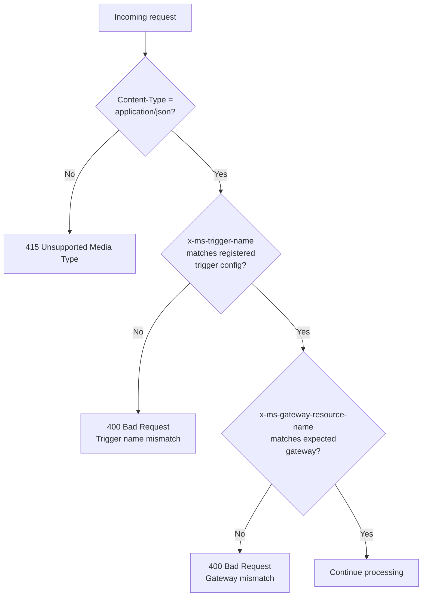

# Connector Trigger - Header Validation & Auth Design

## Pending Confirmations from Connector Namespace Team

Before finalizing header validation, the following must be confirmed:

### Header Contract

- [ ] Headers (`x-ms-subscription-id`, `x-ms-resource-group`, `x-ms-gateway-resource-name`, `x-ms-trigger-name`) are sent on **every** trigger callback request
- [ ] Header names are **finalized** and the Connector Namespace team will inform us before any changes

### Uniqueness

- [ ] `x-ms-gateway-resource-name` uniqueness level confirmed:
  - [ ] Per resource group
  - [ ] Per subscription
  - [ ] Globally
- [ ] `x-ms-trigger-name` uniqueness level confirmed:
  - [ ] Per namespace
  - [ ] Globally
- [ ] `x-ms-gateway-resource-name` + `x-ms-trigger-name` is sufficient to uniquely identify a trigger config

### Authentication

- [ ] Connector Namespace supports (or plans to support) Managed Identity auth for callback requests (`Authorization: Bearer` token)

## Overview

The Connector Namespace sends metadata headers with each trigger callback. The connector extension validates these headers to ensure the request is correctly routed. For caller authentication, the extension relies on the system key (`?code=`) as baseline auth. Stronger authentication via App Service Easy Auth with Managed Identity is a future enhancement, pending Connector Namespace support for sending bearer tokens in callbacks.

This feature is targeted for **preview** release.

### What We Implement vs What We Recommend

| Layer | Owner | What |
| ------- | ------- | ------ |
| **Content-Type validation** | Extension | Reject non-`application/json` with 415 |
| **Header matching** | Extension | Validate `x-ms-trigger-name` and `x-ms-gateway-resource-name` |
| **HTTP method validation** | Extension | POST/PUT only, 405 otherwise (already done) |
| **JSON body validation** | Extension | `JsonDocument.Parse()`, 400 on invalid JSON (already done) |
| **Body size validation** | Extension | 10MB limit, 413 on oversize (already done) |
| **System key auth** | Functions host (platform) | `?code=` validated by the host automatically |
| **Easy Auth + MI** | Future (requires Connector Namespace MI upstream auth) | Only works when the caller sends `Authorization: Bearer` token. Blocked on Connector Namespace support |

## Dependencies and Prerequisites

### Extension-Side Dependencies

No new NuGet packages required. Uses `System.Net.Http.Headers` (in-box) for header access.

### Connector Namespace Prerequisites

| Prerequisite | Details | Priority | Status |
| ------------- | --------- | ---------- | -------- |
| **Headers sent on every callback** | Gateway must include `x-ms-trigger-name` and `x-ms-gateway-resource-name` on all trigger callbacks | P0 - blocks header validation | Available (confirmed from TriggerConfig payload) |
| **MI auth for upstream callbacks** | Gateway uses its Managed Identity to send `Authorization: Bearer {token}` when the Function App has Easy Auth enabled | P1 - strongest auth model | Gateway has MI, upstream auth not yet confirmed |

## Headers from Connector Namespace

The Connector Namespace includes these headers in every trigger callback notification.
The extension validates them against the `[ConnectorTrigger]` attribute properties.

| Header | Attribute Property | Example | Validation |
| -------- | ------------------- | --------- | ------------ |
| `x-ms-trigger-name` | `TriggerName` | `email-newemail-trigger` | Must match attribute value |
| `x-ms-gateway-resource-name` | `ConnectorNamespace` | `my-connector-namespace` | Must match attribute value |
| `Content-Type` | (none) | `application/json` | Must be `application/json` |

## Trigger Attribute Properties

The `[ConnectorTrigger]` attribute needs two properties for header validation.
Both support `%AppSetting%` syntax for externalized config.

```csharp
[Function("OnNewEmailReceived")]
public void HandleEmail(
    [ConnectorTrigger(
        TriggerName = "email-newemail-trigger",     // validates x-ms-trigger-name
        ConnectorNamespace = "my-connector-namespace")]     // validates x-ms-gateway-resource-name
    Office365OnNewEmailV3TriggerPayload payload)
```

Using `%AppSetting%` syntax for deployment-time flexibility:

```csharp
[ConnectorTrigger(
    ConnectorNamespace = "%MyGateway%",
        TriggerName = "%EmailTriggerName%")]
```

```json
// local.settings.json or app settings
{
    "EmailTriggerName": "email-newemail-trigger",
    "MyGateway": "my-connector-namespace"
}
```

| Property | Required | Supports %AppSetting% | Purpose |
| ---------- | :---: | :---: | --------- |
| `TriggerName` | Yes | Yes | Name of the TriggerConfig resource in the gateway (e.g., `email-newemail-trigger`) |
| `ConnectorNamespace` | Yes | Yes | Name of the Connector Namespace resource (e.g., `my-connector-namespace`) |

Note: The trigger config name (`email-newemail-trigger`) is different from the function name
(`OnNewEmailReceived`). The function name is used for URL routing (`?functionName=`),
the trigger name is used for header validation.

## Validation Flow



## Implementation

### For Preview

1. **Content-Type validation** - reject non-`application/json` with 415
2. **Header matching** - enforce `x-ms-trigger-name` and `x-ms-gateway-resource-name`
3. **Diagnostic logging** - log `x-ms-trigger-name` and `x-ms-gateway-resource-name` for debugging

### Failure Responses

| Condition | Status Code | Body |
| ----------- | ------------- | ------ |
| Content-Type not `application/json` | 415 Unsupported Media Type | "Content-Type must be application/json" |
| `x-ms-trigger-name` mismatch | 400 Bad Request | "Trigger name mismatch" |
| `x-ms-gateway-resource-name` mismatch | 400 Bad Request | "Gateway resource mismatch" |
| Missing `x-ms-trigger-name` | 400 Bad Request | "Missing required header: x-ms-trigger-name" |

### Where It Lives

`ConnectorHttpRequestProcessor.ProcessAsync()`, before body parsing. The validation order is: Content-Type -> header matching -> body parsing -> execution.

## Security Best Practices (future - pending Connector Namespace MI support)

The following guidance applies **once the Connector Namespace supports sending `Authorization: Bearer` tokens** in callback requests. Until then, the system key (`?code=`) + header validation is the auth model.

When MI upstream auth becomes available, enable **App Service Authentication (Easy Auth)** with Microsoft Entra ID on your Function App:

1. Enable Easy Auth on the Function App (Azure Portal > Function App > Authentication > Add Microsoft Entra ID)
2. The Connector Namespace uses its system-assigned Managed Identity to send `Authorization: Bearer` tokens in callbacks
3. Easy Auth validates the JWT at the platform level - no extension code changes needed

This provides caller verification with short-lived tokens and no shared secrets.

---

## Ask for Connector Namespace Team

### Send headers on every callback (P0)

Include `x-ms-trigger-name` and `x-ms-gateway-resource-name` in every trigger callback request. The extension validates these to ensure events are routed to the correct function.

### Support MI for upstream auth (P1)

When calling the trigger callback URL, use the gateway's Managed Identity to authenticate:

1. Request an Entra ID token with the Function App as the audience
2. Send `Authorization: Bearer {token}` in the callback request

This enables Function Apps with Easy Auth to verify the caller identity at the platform level. No extension code changes are needed - Easy Auth handles JWT validation.

The Connector Namespace already has a system-assigned Managed Identity enabled. This ask is about using that MI when making outbound callback requests to Function Apps.
