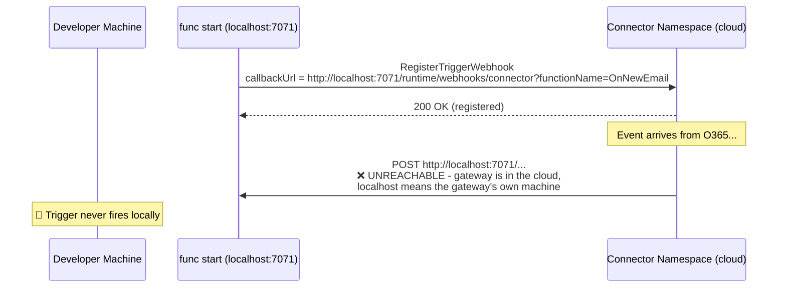
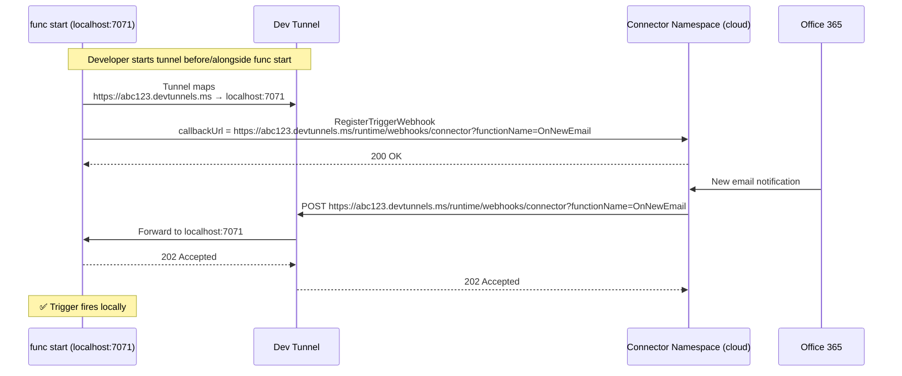
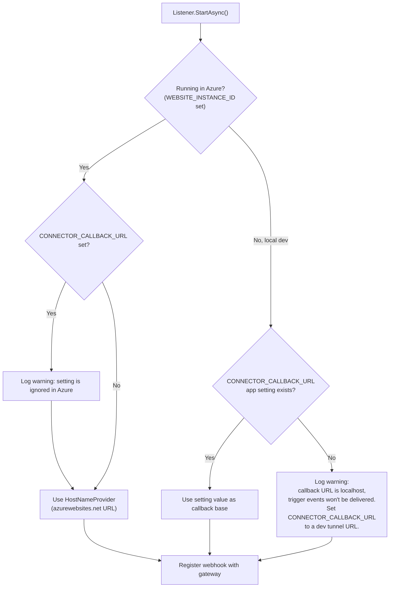

# Connector Trigger - Local Dev Experience with Dev Tunnels

## 1. The Problem: Localhost Callbacks Don't Work



The webhook URL the extension registers during `Listener.StartAsync()` is derived from
`HostNameProvider` / `WEBSITE_HOSTNAME`. Locally, this resolves to `localhost:7071` - a URL that is meaningless to an external cloud service.

## 2. The Solution: Dev Tunnel as a Reverse Proxy

[Dev Tunnels](https://learn.microsoft.com/azure/developer/dev-tunnels/) create a public URL that tunnels traffic to the developer's local machine.



## 3. How the Extension Detects and Uses Dev Tunnels

The extension needs to know the tunnel URL to register it as the callback instead of
`localhost`. There are several detection approaches:

### Option A: App Setting Override (simplest, recommended for v1)

The developer provides the tunnel URL in `local.settings.json`:

```json
{
    "Values": {
        "CONNECTOR_CALLBACK_URL": "https://abc123.devtunnels.ms",
        "FUNCTIONS_WORKER_RUNTIME": "dotnet-isolated"
    }
}
```

The extension uses this URL as the callback base when present, falling back to the host's default URL otherwise.



### Option B: VS Code Port Forwarding (manual)

VS Code has a built-in **Ports** panel that can forward local ports via Dev Tunnels.
However, there are significant limitations that prevent auto-detection:

**Limitations of VS Code port forwarding auto-detection:**

- The Functions host runs as a standalone process (`func start`), **not** as a VS Code
  extension. It has no access to VS Code extension APIs like `vscode.env.asExternalUri()`.
- VS Code does not set stable, documented environment variables (e.g.
  `VSCODE_PORT_FORWARDING`) in spawned terminals that the host process could read.
- The forwarded URL is only visible in the VS Code Ports panel UI — there is no
  file or API contract the host can query at runtime.
- Port forwarding state is ephemeral and tied to the VS Code session; it can change
  without the Functions host being notified.

Because of these limitations, VS Code port forwarding **requires the same manual step**
as the CLI: the developer must copy the forwarded URL into `CONNECTOR_CALLBACK_URL`.

**Developer workflow (VS Code Ports panel):**

1. Start `func start` in the VS Code integrated terminal.
2. Open the **Ports** panel (Ctrl+Shift+P → "Forward a Port").
3. Forward port `7071`. VS Code creates a Dev Tunnel automatically.
4. Copy the forwarded URL from the Ports panel (e.g. `https://abc123.devtunnels.ms`).
5. Add to `local.settings.json`:
   ```json
   "CONNECTOR_CALLBACK_URL": "https://abc123.devtunnels.ms"
   ```
6. Restart `func start`.

This is functionally equivalent to Option A but uses VS Code's UI instead of the
`devtunnel` CLI. The `CONNECTOR_CALLBACK_URL` app setting is the single integration point for both workflows.

### Option C: Built-in Tunnel Creation (future)

The extension itself creates a dev tunnel on startup using the
`Microsoft.DevTunnels.Connections` SDK:

```csharp
// Future: extension creates tunnel automatically
var tunnel = await tunnelClient.CreateTunnelAsync(new Tunnel { ... });
var callbackUrl = tunnel.Endpoints.First().HostAddress;
```

This is the best UX but adds a significant dependency. Defer to v2+.

## 4. Recommended Approach - Phased

### Phase 1 (v1): App Setting Override + Clear Error Message

| Component | Behavior |
| ----------- | ---------- |
| `CONNECTOR_CALLBACK_URL` | If set, use as callback base URL |
| Localhost detection | If callback resolves to localhost and no override, **log a warning** with setup instructions |
| Registration | Still registers with gateway (even with localhost - gateway will accept it, events just won't arrive) |

Developer workflow:

```
# 1. Create a dev tunnel (one-time setup)
devtunnel create --allow-anonymous
devtunnel port create -p 7071

# 2. Start tunnel
devtunnel host

# 3. Copy the tunnel URL to local.settings.json
"CONNECTOR_CALLBACK_URL": "https://abc123.devtunnels.ms"

# 4. Start function
func start
```

### Phase 2 (v2): Built-In Tunnel

Extension creates and manages the tunnel itself using the `Microsoft.DevTunnels.Connections`
SDK. Zero config local experience. `CONNECTOR_CALLBACK_URL` remains as explicit override.

## 5. Extension Code Changes for Phase 1

### ConnectorListener - Callback URL Resolution

```csharp
private static bool IsRunningInAzure() =>
    !string.IsNullOrEmpty(Environment.GetEnvironmentVariable("WEBSITE_INSTANCE_ID"));

// In Listener.StartAsync()
private Uri ResolveCallbackUrl(Uri webhookBaseUrl, string functionName)
{
    var callbackOverride = Environment.GetEnvironmentVariable("CONNECTOR_CALLBACK_URL");
    
    Uri baseUrl;
    if (IsRunningInAzure())
    {
        // SECURITY: Always use HostNameProvider in Azure.
        // CONNECTOR_CALLBACK_URL is a local-dev-only setting — honoring it in Azure
        // would allow event data exfiltration to arbitrary endpoints.
        if (!string.IsNullOrEmpty(callbackOverride))
        {
            _logger.LogWarning(
                "CONNECTOR_CALLBACK_URL is set but ignored in Azure. " +
                "The host's URL from HostNameProvider is used instead. " +
                "Remove this setting to suppress this warning.");
        }
        baseUrl = webhookBaseUrl;
    }
    else if (!string.IsNullOrEmpty(callbackOverride))
    {
        // Local development: use the dev tunnel URL
        baseUrl = new Uri(callbackOverride.TrimEnd('/'));
        _logger.LogInformation(
            "Using CONNECTOR_CALLBACK_URL override: {Url}", baseUrl);
    }
    else
    {
        baseUrl = webhookBaseUrl;
        
        // Warn if localhost - gateway can't reach it
        if (baseUrl.IsLoopback)
        {
            _logger.LogWarning(
                "Callback URL is localhost ({Url}). The Connector Namespace cannot deliver " +
                "events to localhost. Set CONNECTOR_CALLBACK_URL to a dev tunnel URL. " +
                "See: https://aka.ms/func-connector-local-dev",
                baseUrl);
        }
    }
    
    // Append functionName query parameter
    var builder = new UriBuilder(baseUrl);
    builder.Path = builder.Path.TrimEnd('/') + "/runtime/webhooks/connector";
    builder.Query = $"functionName={functionName}";
    return builder.Uri;
}
```

### Warning Output (what the developer sees)

```
[2026-04-01T10:00:00Z] warn: Connector Trigger
    Callback URL is localhost (http://localhost:7071). The Connector Namespace cannot deliver
    events to localhost. Set CONNECTOR_CALLBACK_URL to a dev tunnel URL.
    See: https://aka.ms/func-connector-local-dev
    
    Quick setup:
      1. devtunnel host -p 7071 --allow-anonymous
      2. Add to local.settings.json:
         "CONNECTOR_CALLBACK_URL": "https://<your-tunnel>.devtunnels.ms"
      3. Restart func start
```

## 6. Dev Tunnel Setup Guide (for docs / error message link)

### Prerequisites

```powershell
# Install dev tunnels CLI (one-time)
winget install Microsoft.devtunnel

# Login
devtunnel user login
```

### Create and Host Tunnel

```powershell
# Create a persistent tunnel for port 7071
devtunnel create --allow-anonymous
devtunnel port create -p 7071

# Host it (keep running alongside func start)
devtunnel host
# Output: Connect via browser: https://abc123.devtunnels.ms
```

### VS Code Alternative

1. Start `func start` in the terminal
2. Open the **Ports** panel (Ctrl+Shift+P → "Forward a Port")
3. Forward port `7071`
4. Copy the forwarded URL
5. Add to `local.settings.json` as `CONNECTOR_CALLBACK_URL`

> **Note:** VS Code port forwarding uses Dev Tunnels under the hood but does not expose
> the forwarded URL programmatically to terminal processes. The manual copy step is
> required — see Option B in Section 3 for details on limitations.

## 7. Security Considerations

### CONNECTOR_CALLBACK_URL — Threat Analysis

`CONNECTOR_CALLBACK_URL` is a powerful setting: it controls where the gateway sends event payloads. If misused in Azure, it could redirect sensitive data (emails, calendar events,
notifications) to an attacker-controlled endpoint.

| Threat | Description | Severity |
| -------- | ------------- | ---------- |
| **Event data exfiltration** | An actor with app-setting write access (`Microsoft.Web/sites/config/write`) sets the URL to an external endpoint. The gateway then POSTs event payloads to the attacker. | High |
| **Accidental misconfiguration** | Developer forgets to remove their dev tunnel URL before deploying to Azure. Events go to a dead tunnel (silent failure) or a recycled tunnel owned by someone else. | Medium |
| **Open redirect via gateway** | The gateway trusts the registered callback URL. If the extension forwards an arbitrary `CONNECTOR_CALLBACK_URL`, it effectively creates an open redirect — the gateway becomes a proxy to any endpoint. | High |
| **Bypass Azure networking controls** | The function app may be behind VNets, Private Endpoints, or IP restrictions. An external `CONNECTOR_CALLBACK_URL` bypasses all of that. | High |

### Mitigation: Ignore CONNECTOR_CALLBACK_URL in Azure

The setting is **local-dev only**. When the extension detects it is running in Azure
(via `WEBSITE_INSTANCE_ID`), it **always** uses the URL from `HostNameProvider` and logs a warning if `CONNECTOR_CALLBACK_URL` is also set.

This is enforced in `ResolveCallbackUrl()` (see Section 5).

```csharp
private static bool IsRunningInAzure() =>
    !string.IsNullOrEmpty(Environment.GetEnvironmentVariable("WEBSITE_INSTANCE_ID"));
```

### Other Concerns

| Concern | Mitigation |
| --------- | ------------ |
| **Tunnel exposes local machine** | Use `--allow-anonymous` only for dev; prod uses Managed Identity + azurewebsites.net URL |
| **Tunnel URL is guessable** | Dev tunnels use random subdomain; for extra security use `--require-login` |
| **CONNECTOR_CALLBACK_URL source** | Only read from app settings (never from headers, query strings, or request body) |
| **Tunnel lifetime** | Tunnel must stay running during local dev session; if it dies, events stop but no data loss (gateway retries or queues) |

## 8. Comparison of Approaches

| Approach | Setup | UX | Dependencies | Phase |
| ---------- | ------- | ---- | ------------- | ------- |
| **App setting override** | Manual (copy URL) | Good | None | v1 |
| **VS Code port forwarding** | Manual (copy URL via UI) | Good | VS Code Ports panel | v1 |
| **Built-in tunnel SDK** | Zero config | Best | `Microsoft.DevTunnels.Connections` NuGet | v2 |
| **ngrok** | Manual | OK | Third-party tool | Not recommended |
