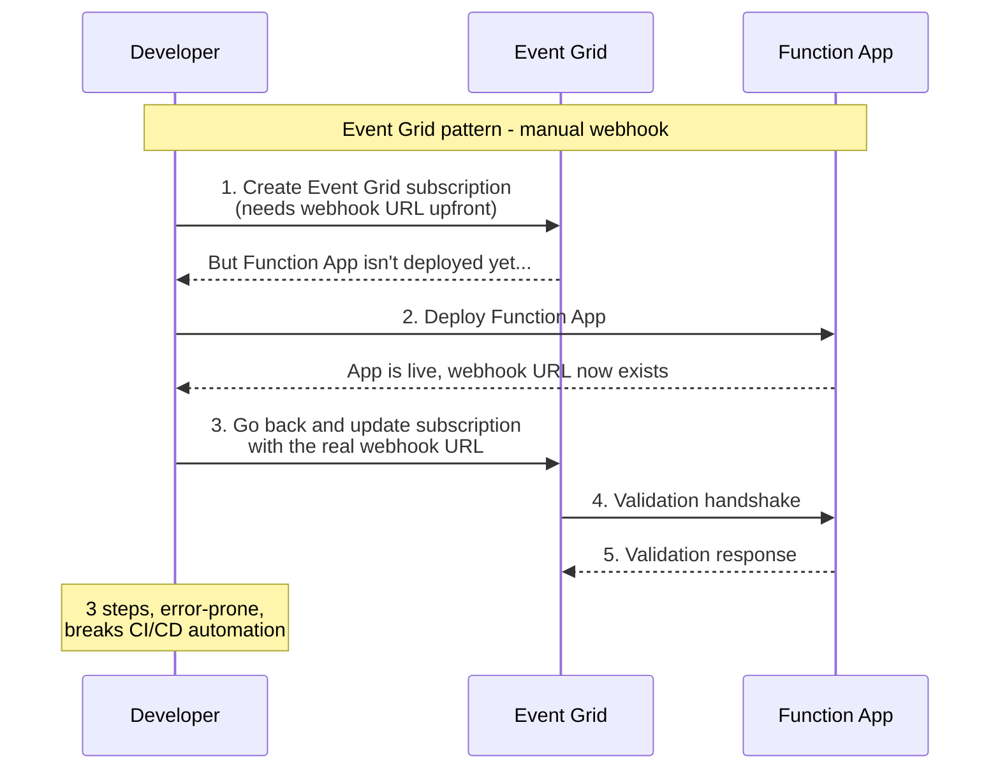
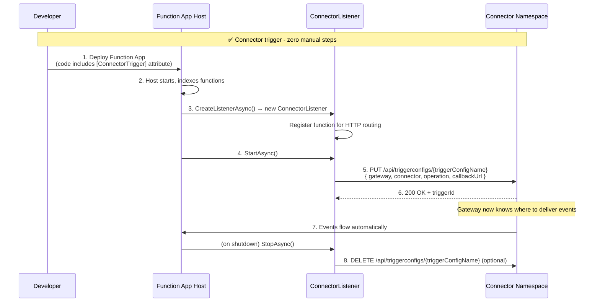
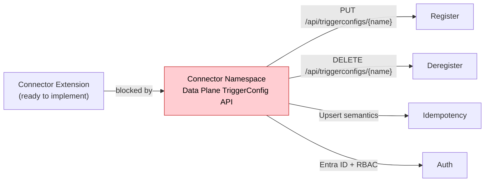
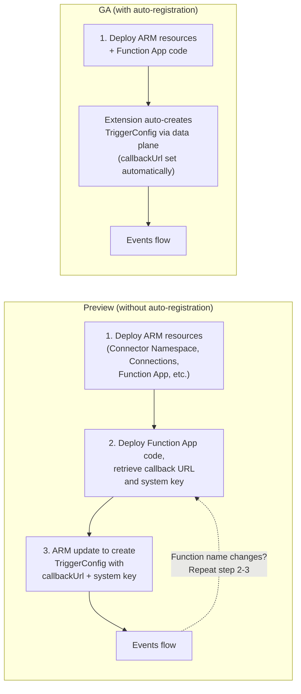
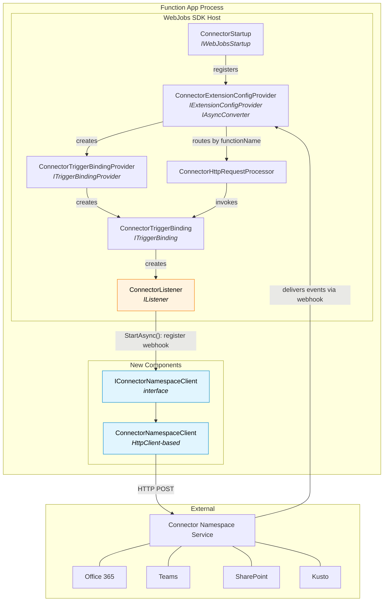
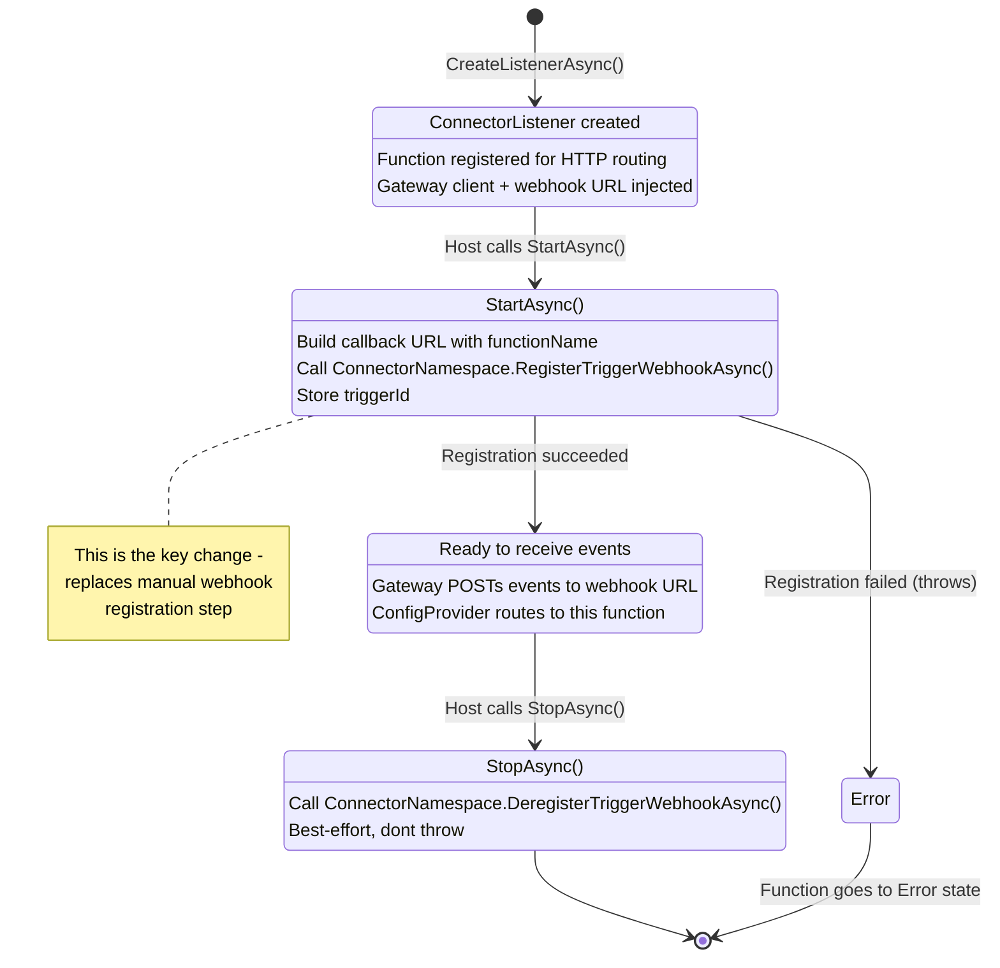
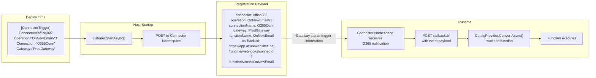
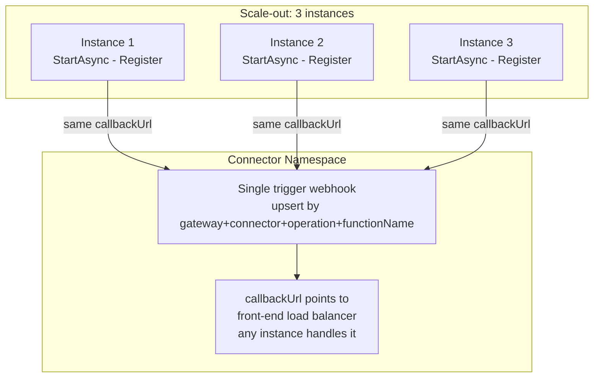
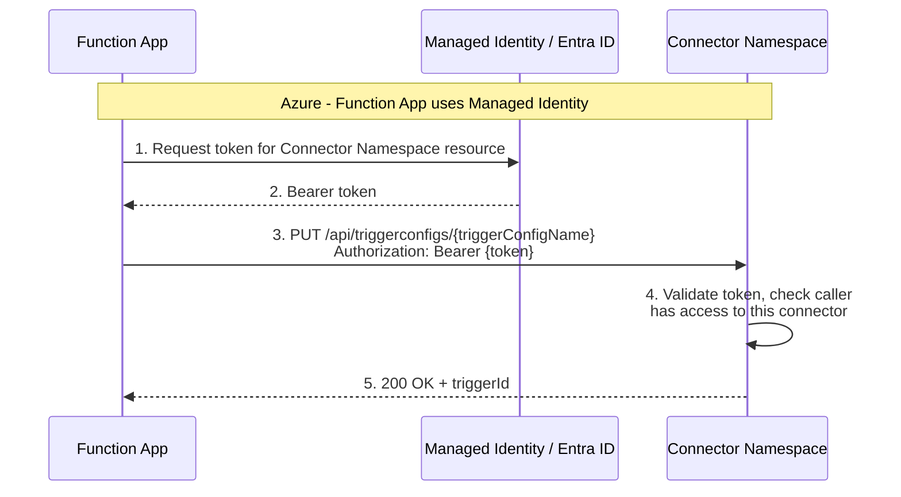

# Connector Trigger - Webhook Auto-Registration Design

## 1. The Problem: Chicken-and-Egg for Webhook-Based Triggers

### Event Grid Today



## 2. The Solution: Self-Registering Connector Trigger (GA target)



## 3. Dependencies and Prerequisites

### Extension-Side Dependencies

| Dependency | Purpose | Already Available? |
| ----------- | --------- | :------------------: |
| `Azure.Identity` | `DefaultAzureCredential` / `ManagedIdentityCredential` for Entra ID tokens | No - needs to be added to `Extensions.Connector.csproj` |
| `System.Net.Http` | `HttpClient` for calling gateway trigger API | Yes - in-box |
| `Microsoft.Extensions.Http` | `IHttpClientFactory` for proper `HttpClient` lifecycle | No - needs to be added |

### Pending Confirmations from Connector Namespace Team

- [ ] Data plane TriggerConfig API (`PUT/DELETE/GET /api/triggerconfigs/{name}`) available
- [ ] Upsert on PUT (same name updates, doesn't duplicate)
- [ ] Entra ID auth with RBAC on data plane endpoints
- [ ] RBAC role defined for triggerconfig management (e.g., "Connector Namespace Trigger Config Contributor")

### Connector Namespace Prerequisites (blocks implementation)

The Connector Namespace has a **control plane API** for TriggerConfig management on ARM
(`PUT/GET/DELETE` at `management.azure.com/.../connectorGateways/{name}/triggerConfigs/{name}`,
api-version `2026-05-01-preview`). The extension needs a **data plane equivalent** -
same TriggerConfig resource, callable against the gateway endpoint with Managed Identity auth.

| Prerequisite | Priority | Status |
| ------------- | ---------- | -------- |
| **Data plane TriggerConfig API** (`PUT/DELETE/GET /api/triggerconfigs/{name}`) | P0 - blocks feature | Control plane exists, data plane not available |
| **Upsert on PUT** (same name updates, doesn't duplicate) | P0 - correctness | Not available |
| **Entra ID auth with RBAC** - data plane accepts Managed Identity tokens; Connector Namespace defines a role (e.g., "Connector Namespace Trigger Config Contributor") for triggerconfig management. Any identity assigned this role on the gateway resource can manage trigger configs | P0 - auth + security | Not available |
| **Trigger TTL / lease for orphan cleanup** | P2 | Not available |

### Function App Prerequisites

| Prerequisite | Details | Default |
| ------------- | --------- | --------- |
| **Managed Identity enabled** | System-assigned or user-assigned MI must be enabled on the Function App | Not enabled by default - must be configured |
| **RBAC role assignment** | Function App's MI must be assigned the "Connector Namespace Trigger Config Contributor" role (or equivalent) on the Connector Namespace resource | Must be configured by User Access Admin or equivalent deployment |
| **Gateway endpoint configured** | `{ConnectorNamespace}` app setting pointing to the gateway URL | Must be set by developer/ARM deployment |
| **Network access to gateway** | Function App must be able to reach the gateway endpoint (VNet/firewall considerations) | Depends on deployment |

### Impact on Preview Release

The connector extension is **not blocked** by the data plane TriggerConfig API.
The extension can ship a preview without webhook auto-registration - developers would manually create TriggerConfigs via the ARM control plane (Portal, CLI, or ARM templates) and set the `callbackUrl` to their function's webhook endpoint after deploying the function app code





**Preview pain points:**

- 3-step deployment process (infra, code, then update TriggerConfig)
- Must retrieve system key and construct callback URL manually
- Every function name change requires repeating steps 2-3 to update the callbackUrl
- CI/CD pipelines need extra steps to fetch webhook URL and patch TriggerConfig

| Aspect | Preview (manual) | GA (auto-registration) |
| -------- | ----------------- | ---------------------- |
| Developer experience | Manual TriggerConfig setup via ARM/Portal | Zero-touch, deploy and it works |
| CI/CD | Requires ARM template for TriggerConfig | Just deploy the function app |
| Blocked by gateway data plane API | No | Yes |
| Extension code changes | None | `IConnectorNamespaceClient`, `ConnectorListener.StartAsync()` |

### Coordination Required

| Team | What We Need | When |
| ------ | ------------- | ------ |
| **Connector Namespace** | Data plane TriggerConfig API spec + endpoint | Before auto-registration implementation |
| **Connector Namespace** | Entra ID auth with RBAC on data plane | Before auto-registration implementation |
| **Connector Namespace** | Upsert semantics on PUT | Before auto-registration implementation |
| **Connector Namespace** | TTL/lease mechanism for orphan cleanup | Can be added later (P2) |

## 4. Component Architecture



## 5. Listener Lifecycle - Where Registration Fits



## 6. Data Flow - What Travels Where



## 7. Idempotency and Scale-Out Behavior



All 3 instances register the same URL. Gateway idempotently upserts.
Front-end load balancer routes to any healthy instance.

## 8. Authentication Model - Gateway Requirements

The `Connection` attribute property is **just a logical name** referencing a pre-created connector inside the Connector Namespace (e.g., `"my-o365-connector"`). The gateway holds the actual OAuth tokens and secrets for that connector. The extension therefore needs **its own auth** to call the gateway's trigger management API.

### App Settings Required

```
# Attribute-level (per function)
Connection = "my-o365-connector"              # Connector name inside the gateway
Gateway    = "ProdGateway"                    # Gateway endpoint name

# Resolved from gateway name
ProdGateway__endpoint = "https://gateway.x.net"

# Auth - no explicit setting needed in Azure (Managed Identity)
ProdGateway__key = "abc..."                   # Optional, local dev only
```

### Auth Flow



### Registration API Contract

The extension will call the **data plane TriggerConfig API** (to be provided by Connector Namespace team).
The data plane API should mirror the existing ARM control plane TriggerConfig resource
(`Microsoft.Web/connectorGateways/triggerConfigs`, api-version `2026-05-01-preview`) but be callable directly against the gateway endpoint.

The extension **cannot use the control plane API** from `Listener.StartAsync()` because:

- ARM calls require ARM bearer tokens with resource-level RBAC - not available from a function execution context
- ARM has throttling limits (1200 writes/hour per subscription) - host restarts across scaled instances would hit these
- ARM is for infrastructure provisioning, not runtime webhook registration

#### How the Extension Maps Attribute → TriggerConfig

| Attribute Property | TriggerConfig Field | Example |
| ------------------- | --------------------- | --------- |
| `ConnectorType` | `properties.connectionDetails.connectorName` | `"office365"` |
| `Connection` | `properties.connectionDetails.connectionName` | `"my-office365-connection"` |
| `Operation` | `properties.operationName` | `"OnNewEmailV3"` |
| Function name | `triggerConfigName` (URL path) | `"OnNewEmail"` |
| Webhook URL | `properties.notificationDetails.callbackUrl` | `"https://app.../runtime/webhooks/connector?functionName=OnNewEmail"` |

#### Key Differences: Control Plane vs Data Plane

| Aspect | Control Plane (ARM) | Data Plane (needed) |
| -------- | ------------------- | ------------------- |
| **Endpoint** | `management.azure.com` | `{gatewayEndpoint}` |
| **Auth** | ARM RBAC token | Managed Identity token scoped to gateway |
| **Throttling** | ARM limits (1200 writes/hr/sub) | Gateway-defined (must handle scale-out re-registration) |
| **Called by** | ARM templates, Portal, CLI | Extension at runtime (`Listener.StartAsync()`) |
| **Upsert by** | Resource name in URL path | Same - `triggerConfigName` in URL path |
| **Request body** | Same `properties` schema | Same `properties` schema |

### Gateway-Side Requirements

Data plane equivalent of the ARM TriggerConfig API with:

- `PUT /api/triggerconfigs/{name}` - upsert (P0)
- `DELETE /api/triggerconfigs/{name}` - cleanup (P1)
- `GET /api/triggerconfigs` - diagnostics (P2)
- Managed Identity auth with RBAC role (P0)
- Same `properties` schema as the ARM control plane resource

### Feasibility: DELETE from Function App

The extension would call `DELETE /api/triggerconfigs/{name}` from `Listener.StopAsync()`
to clean up trigger configs when a function is removed. However, there are challenges:

| Scenario | `StopAsync()` runs? | Should DELETE? | Why |
| ---------- | :-------------------: | :--------------: | ----- |
| Graceful shutdown (deploy, restart) | Yes | No - host will restart and re-register |  Deleting would cause a gap where events are lost |
| Scale-in (3 instances to 1) | Yes | No - other instances serve same URL | All instances share one callbackUrl via front-end LB |
| App deleted | No - process killed | Would want to, but can't | `StopAsync()` doesn't run on forced termination |
| Function removed from code | Yes (next deploy) | Yes - trigger is orphaned | Only case where DELETE is correct |

**Conclusion:** `StopAsync()` is not a reliable place for DELETE because:

1. Most shutdowns are temporary (deploy, restart, scale-in) - deleting would cause event loss
2. The one case where DELETE is needed (app deleted) is the one where `StopAsync()` doesn't run

**Recommendation:** Don't call DELETE from `StopAsync()`. Rely on TTL/lease or manual cleanup via ARM control plane.

### Feasibility: TTL / Lease for Orphan Cleanup

The gateway could auto-expire trigger configs that haven't been renewed within a TTL window.
The extension would refresh the TTL on every `StartAsync()` (which runs on every host restart).

| Aspect | Challenge |
| -------- | ---------- |
| **TTL duration** | Too short (e.g., 1h) - Consumption plan cold starts can take minutes, but apps may be idle for hours with no host running. Trigger expires, events lost until next invocation. Too long (e.g., 7d) - orphans linger for a week |
| **Consumption plan idle** | App scales to zero, no host running, no `StartAsync()` to refresh TTL. But that's also when there's no instance to receive events - so the trigger is effectively dormant anyway |
| **Always-on SKUs** | Premium/Dedicated have at least one instance always running. `StartAsync()` runs on every restart (deploy, platform recycle ~every 24-48h). TTL of 72h would work |
| **Who refreshes?** | Only the primary instance? All instances? If all instances refresh, it's redundant but harmless (idempotent PUT already handles this) |
| **Heartbeat vs restart** | Could add a periodic heartbeat timer in `ConnectorListener` to refresh TTL independently of host restarts. Adds complexity |

**Conclusion:** TTL works well for always-on SKUs but is problematic for Consumption plan.
A simpler approach may be:

- No TTL - trigger configs persist until explicitly deleted
- Orphaned configs are cleaned up via ARM control plane (Portal, CLI, or ARM template)
- Future: the gateway could detect unreachable callbackUrls and mark triggers as stale

> **Open item:** Discuss with team - what is the right cleanup strategy for orphaned trigger
> configs? Options: TTL/lease, gateway-side health checks on callbackUrl, manual cleanup only,
> or tie trigger config lifecycle to the Function App ARM resource (delete app = delete triggers).
> This affects both the extension design and the Connector Namespace contract.

### Auth Decision Rationale

| Option | Verdict | Why |
| -------- | --------- | ----- |
| Reuse `Connection` credential | **Not possible** | `Connection` is just a name, not a credential |
| **Managed Identity (primary)** | **Chosen** | Zero config in Azure, no secrets to manage, standard Entra ID pattern |
| Full ARM RBAC role | **Deferred** | Requires resource provider registration, overkill for v1 - connection-level access check is sufficient |

## 9. Key Design Decisions

| Aspect | Decision | Rationale |
| -------- | ---------- | ----------- |
| **When to register** | `Listener.StartAsync()` | Host is listening, routes are live, safe to receive callbacks |
| **When to deregister** | `Listener.StopAsync()` (best-effort) | Graceful cleanup; swallow errors since gateway can use TTL/lease ?? |
| **Idempotency** | Gateway must upsert by `(connector, operation, functionName)` | Multiple instances + restarts will re-register the same URL |
| **Registration failure** | Throw from `StartAsync` → function enters Error state | A trigger that can't receive events should not appear healthy |
| **Auth to gateway** | Managed Identity | `Connection` is just a connector name, not a credential - Function App authenticates via Managed Identity |
| **New files** | `IConnectorNamespaceClient.cs` + `ConnectorNamespaceClient.cs` | Thin interface + HTTP implementation; easily mockable for tests |
| **Modified files** | `ConnectorListener`, `ConnectorTriggerBinding`, `ConnectorExtensionConfigProvider`, `ConnectorWebJobsBuilderExtensions` | Wire up gateway client + webhook URL through the existing chain |

## 10. Files Changed Summary

### New Files

| File | Purpose |
| ------ | --------- |
| `IConnectorNamespaceClient.cs` | Interface for gateway registration/deregistration |
| `ConnectorNamespaceClient.cs` | HTTP-based implementation calling Connector Namespace REST API |

### Modified Files

| File | Change |
| ------ | -------- |
| `ConnectorListener.cs` | Add `StartAsync` → register webhook, `StopAsync` → deregister |
| `ConnectorExtensionConfigProvider.cs` | Store webhook base URL from `GetWebhookHandler()`, expose it |
| `ConnectorTriggerBinding.cs` | Pass `IConnectorNamespaceClient` + webhook URL to `ConnectorListener` |
| `ConnectorWebJobsBuilderExtensions.cs` | Register `IConnectorNamespaceClient` / `ConnectorNamespaceClient` in DI |
